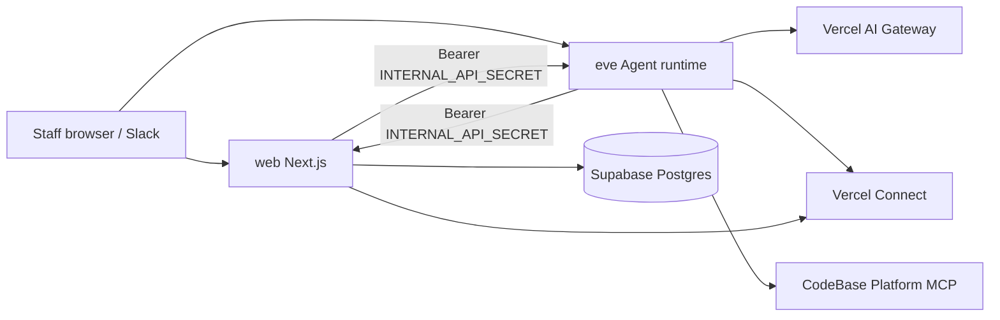

# Agent C — Deployment & Configuration Guide

End-to-end guide for running Agent C locally and in production on Vercel.
This is the operational companion to [Environment](ENVIRONMENT.md),
[Platform interop](PLATFORM_INTEROP.md), and [Connect](CONNECT.md).

---

## 1. Architecture

Agent C is one git repo deployed as **two Vercel services** ([`vercel.json`](../vercel.json)):

| Service | Framework | Route prefix | Responsibility |
| ------- | --------- | ------------ | -------------- |
| **web** | Next.js (`withEve`) | `/` | Chat UI, Better Auth, DB, Flags, Integrations UI, `/api/internal/*` |
| **eve** | Eve (`eve build`) | `/_eve_internal/eve` | Agent runtime, Slack channel, MCP connections, tool execution |



Eve never authenticates end users with Google. Web owns OAuth sessions; Eve
receives already-authenticated web traffic and Slack webhooks. Shared work
(memory, model routing, Slack link) goes through `/api/internal/*` with
`INTERNAL_API_SECRET`.

---

## 2. Prerequisites

- Node.js **≥ 24**, `pnpm` **11** (see `packageManager` in `package.json`)
- Vercel CLI (`pnpm dlx vercel` or global install), team access to
  **thisiscodebase** (or your team)
- Supabase project (Postgres + `pgvector`)
- Google Cloud OAuth client (Workspace-restricted)
- Paid **AI Gateway** usage on the Vercel team (hosting Pro ≠ free Gateway
  credits)
- Optional for full product: HubSpot MCP Auth App, Notion, Tally, Slack app,
  GCP Drive MCP APIs, CodeBase Platform deploy

---

## 3. Local development

### 3.1 Clone and install

```bash
cd ~/Developer/agent-c
pnpm install
```

If `pnpm add` fails on `minimumReleaseAge`, use:

```bash
pnpm add <pkg> --config.minimumReleaseAge=0
```

### 3.2 Link Vercel and pull env

```bash
vercel link --scope thisiscodebase
vercel env pull .env.local --scope thisiscodebase
```

`vercel env pull` refreshes `VERCEL_OIDC_TOKEN` (needed for Connect locally).
Re-pull if Connect calls start failing with auth errors.

### 3.3 Minimum local secrets

Create or complete `.env.local` (never commit):

| Variable | Example / how to generate | Notes |
| -------- | ------------------------- | ----- |
| `BETTER_AUTH_SECRET` | `openssl rand -base64 32` | Session signing |
| `BETTER_AUTH_URL` | `http://localhost:3000` | Public app origin |
| `INTERNAL_API_SECRET` | `openssl rand -base64 32` | Same value Eve ↔ web use for `/api/internal/*` |
| `DATABASE_URL` | Pooled Supabase URI (`:6543`) | App queries; `{ prepare: false }` |
| `DIRECT_URL` | Direct Supabase URI (`:5432`) | Drizzle migrations only |
| `GOOGLE_CLIENT_ID` / `GOOGLE_CLIENT_SECRET` | GCP OAuth client | |
| `GOOGLE_WORKSPACE_DOMAIN` | e.g. `codebase.com` | Restricts Google login |
| `FLAGS_SECRET` | see below | Flags SDK |

```bash
node -e "console.log(crypto.randomBytes(32).toString('base64url'))"
```

Use a **distinct** `FLAGS_SECRET` per environment (dev / preview / production).

### 3.4 Database

Ensure `pgvector` is available (migration or Supabase extension). Apply Drizzle
migrations:

```bash
pnpm db:generate   # after schema changes
pnpm db:migrate    # uses DIRECT_URL ?? DATABASE_URL
```

Also apply any hand-written SQL under `supabase/migrations/` in the Supabase
SQL editor or CLI when noted in release notes (e.g. thread feedback).

### 3.5 Google OAuth redirect

In the GCP OAuth client, add:

- `http://localhost:3000/api/auth/callback/google`
- Production: `https://<your-agent-c-host>/api/auth/callback/google`

Consent screen should be **Internal** (Workspace) for CodeBase staff only.

### 3.6 Run

```bash
pnpm dev          # Next.js + Eve
pnpm typecheck
pnpm build        # production build smoke
```

Open `http://localhost:3000`, sign in with a Workspace Google account, and
confirm chat responds (AI Gateway auth via OIDC or `AI_GATEWAY_API_KEY`).

### 3.7 Optional local Platform MCP

Run Platform on another port (e.g. `3001`) and set on Eve:

```bash
PLATFORM_MCP_URL=http://localhost:3001/api/mcp
PLATFORM_MCP_TOKEN=<same as Platform>
```

See [Platform interop](PLATFORM_INTEROP.md) for Platform-side vars.

---

## 4. Production deployment (Vercel)

### 4.1 Project layout

Deploy from the same linked project that owns Connect resources. Services:

- **web** — Next.js entrypoint `.`
- **eve** — `eve build`, routes under `/_eve_internal/eve`

Both services need overlapping secrets where Eve calls web (and vice versa).

### 4.2 Environment matrix

Set these in the Vercel project for **Production** (and Preview as needed).
Mark secrets Sensitive where appropriate.

#### Core (both services unless noted)

| Variable | web | eve | Purpose |
| -------- | --- | --- | ------- |
| `BETTER_AUTH_SECRET` | ✓ | ✓* | Auth / callbacks |
| `BETTER_AUTH_URL` | ✓ | ✓ | Canonical public URL (no trailing slash) |
| `INTERNAL_API_SECRET` | ✓ | ✓ | **Must match** on both |
| `DATABASE_URL` | ✓ | if Eve queries DB | Pooled Postgres |
| `DIRECT_URL` | CI / migrate only | — | Unpooled migrate |
| `VERCEL_OIDC_TOKEN` | auto / pull | auto / pull | Connect + often Gateway |

\*Eve needs `BETTER_AUTH_URL` to call web internal APIs and build Slack link URLs.

#### Auth (web)

| Variable | Required |
| -------- | -------- |
| `GOOGLE_CLIENT_ID` | Yes |
| `GOOGLE_CLIENT_SECRET` | Yes |
| `GOOGLE_WORKSPACE_DOMAIN` | Yes (Workspace lock) |

#### AI Gateway

| Variable | Notes |
| -------- | ----- |
| `AI_GATEWAY_API_KEY` | Optional if OIDC covers Gateway on Vercel; required for some non-OIDC setups |
| Team AI credits | Top up in Vercel dashboard — free Gateway tier is separate from hosting |

Per-request privacy (no team-wide ZDR charge): Agent C sets
`disallowPromptTraining: true` and `zeroDataRetention: true` on Gateway calls,
except `xai/grok-4.5` which omits ZDR (keeps no-training). See
[`shared/models.ts`](../shared/models.ts).

#### Flags (web; evaluated for model routing)

| Variable | Required |
| -------- | -------- |
| `FLAGS_SECRET` | Yes |

Create flags in the Vercel Flags dashboard (or promote drafts from Flags
Explorer). Keys and defaults:

| Flag key | Default | Allowed values |
| -------- | ------- | -------------- |
| `agent-tier` | `chat` | `chat`, `premium`, `extreme` |
| `agent-nano-model` | `openai/gpt-5.4-nano` | nano pool |
| `agent-chat-model` | `openai/gpt-5.6-luna` | chat pool |
| `agent-premium-model` | `anthropic/claude-sonnet-5` | `anthropic/claude-sonnet-5`, `xai/grok-4.5`, `openai/gpt-5.6-terra` |
| `agent-extreme-model` | `openai/gpt-5.6-sol` | extreme pool |

Discovery endpoint: `GET https://<host>/.well-known/vercel/flags`.

Invalid flag values fall back to catalog defaults. Eve resolves the agent model
once per session via `GET /api/internal/model-routing`.

#### Platform MCP (eve + Platform app)

| Variable | Where |
| -------- | ----- |
| `PLATFORM_MCP_URL` | Agent C **eve** |
| `PLATFORM_MCP_TOKEN` | Agent C **eve** + Platform (same value) |
| `PLATFORM_WORKSPACE_ID` | Platform only |
| `PLATFORM_MCP_PUBLIC_ORIGIN` | Platform only (permalinks) |
| `PLATFORM_MCP_WRITES_ENABLED` | Platform only — leave off for internal release |

#### Connect

No long-lived provider API keys in env once connectors are attached. UIDs in
[`shared/connect.ts`](../shared/connect.ts) must match `vercel connect list`.

### 4.3 Deploy

```bash
git push   # or vercel --prod from a clean tree
```

After first deploy:

1. Confirm `BETTER_AUTH_URL` matches the production hostname.
2. Confirm Google OAuth redirect URI includes production callback.
3. Run migrations against production `DIRECT_URL` (from a trusted machine/CI):

   ```bash
   vercel env pull .env.production.local --environment production
   # load DIRECT_URL then:
   pnpm db:migrate
   ```

4. Create/attach Connectors (section 5).
5. Configure Flags (section 6).
6. Smoke-test (section 8).

---

## 5. Connectors (Vercel Connect)

Run from the linked Agent C project after `vercel link`:

```bash
# Drive — GCP OAuth client + Drive MCP APIs first
vercel connect create https://drivemcp.googleapis.com/mcp/v1 --name codebase-agent
vercel connect attach <drive-uid> --yes

# HubSpot — MCP Auth App in HubSpot first
vercel connect create mcp.hubspot.com --name codebase-agent
vercel connect attach <hubspot-uid> --yes

# Notion
vercel connect create mcp.notion.com --name codebase-agent
vercel connect attach <notion-uid> --yes

# Tally
vercel connect create https://api.tally.so/mcp --name agent-c
vercel connect attach <tally-uid> --yes

vercel connect list
vercel env pull .env.local
```

Update [`shared/connect.ts`](../shared/connect.ts) if UIDs differ from the
placeholders. Slack channel + search reuse Connect app `slack/v` — expand Slack
app scopes for Real-time Search (`search:read.public`, `search:read.private`,
`search:read.files`, `search:read.users`). Do **not** use legacy `search:read`.

Per-connector operator notes: [Platform interop §3.D](PLATFORM_INTEROP.md).

---

## 6. Model routing & Flags

### Behavior

| Tier | Used for | Default model | Reasoning |
| ---- | -------- | ------------- | --------- |
| **nano** | Thread titles / light tasks | `openai/gpt-5.4-nano` | — |
| **chat** | Default Eve sessions | `openai/gpt-5.6-luna` | `high` |
| **premium** | Heavier work (ops sets `agent-tier`) | `anthropic/claude-sonnet-5` | `high` |
| **extreme** | Frontier / high-stakes | `openai/gpt-5.6-sol` | `high` |

Code: [`flags.ts`](../flags.ts), [`shared/models.ts`](../shared/models.ts),
[`server/utils/model-routing.ts`](../server/utils/model-routing.ts),
[`agent/agent.ts`](../agent/agent.ts).

### Ops playbook

1. Ensure `FLAGS_SECRET` is set on web.
2. In Vercel → Flags (or Toolbar Flags Explorer on a preview), set:
   - `agent-tier` → `chat` | `premium` | `extreme`
   - Per-tier model flags when changing within a pool
3. New Eve sessions pick up the new model on `session.started` (existing
   sessions keep the model resolved at start).
4. To use Grok on premium: set `agent-premium-model` to `xai/grok-4.5` and
   `agent-tier` to `premium`. ZDR is automatically omitted for that model.

### Privacy

- Prefer **per-request** ZDR + no-training (already in code) over team-wide ZDR
  billing unless you want a hard org-wide enforcement toggle.
- Team-wide ZDR in AI Gateway Settings is optional and costs $0.10 / 1k
  successful requests.

---

## 7. Slack channel

1. Connect app `slack/v` attached (see above).
2. Slack app event URL / Eve webhook path must match Eve’s Slack channel
   route under `/_eve_internal/eve/...` (see Eve Slack docs / channel file
   [`agent/channels/slack.ts`](../agent/channels/slack.ts)).
3. Users link Slack in **Settings → Integrations** (uses
   `INTERNAL_API_SECRET` + web session).
4. Test `@mention` / DM; identity should map to the same Better Auth user as
   web for memory continuity.

---

## 8. Verification checklist

### Local

- [ ] `pnpm dev` starts; Google Workspace login works
- [ ] Chat returns a model response (Gateway)
- [ ] Thread title generates after a message (nano)
- [ ] Settings → Integrations lists connectors; Connect/Test where configured
- [ ] Platform shows configured when Eve env is set; chat can list companies
- [ ] `pnpm typecheck` clean

### Production

- [ ] Both **web** and **eve** healthy on the deployment
- [ ] `BETTER_AUTH_URL` = production URL; OAuth callback registered
- [ ] Migrations applied; login persists sessions
- [ ] Flags: unset → chat + Luna; flip `agent-tier` to `premium` and confirm
      new sessions use Sonnet (or selected premium model)
- [ ] Integrations: Drive, HubSpot, Notion, Tally, Slack, Platform smoke queries
- [ ] Slack mention works with linked account
- [ ] No invented Platform permalinks (tools return absolute `url`s)

---

## 9. Common failures

| Symptom | Likely cause |
| ------- | ------------ |
| 401 on `/api/internal/*` | `INTERNAL_API_SECRET` missing/mismatched between web and eve |
| Connect works in prod, fails locally | Stale OIDC — `vercel env pull` |
| HubSpot `AUTHORIZATION_ERROR` | Reconnect and approve CRM objects; check scopes in `shared/connect.ts` |
| Gateway / model errors | AI credits exhausted; or ZDR requested for a non-ZDR model (shouldn’t happen unless catalog is wrong) |
| Flags always default | `FLAGS_SECRET` missing; flag keys not created; evaluation error → defaults |
| Eve can’t reach web | `BETTER_AUTH_URL` wrong on eve; use public HTTPS origin in production |
| DB connection errors under load | Use pooled `DATABASE_URL` (`:6543`), not direct, for the app |

---

## 10. Related docs

| Doc | Contents |
| --- | -------- |
| [ENVIRONMENT.md](ENVIRONMENT.md) | Env delta from upstream template |
| [PLATFORM_INTEROP.md](PLATFORM_INTEROP.md) | Platform MCP + Connect production |
| [CONNECT.md](CONNECT.md) | Connect vs DIY, pricing |
| [ARCHITECTURE.md](ARCHITECTURE.md) | System design |
| [CUSTOMIZATION.md](CUSTOMIZATION.md) | Diff from personal-agent-template |
| [AGENTS.md](../AGENTS.md) | Agent-facing quick reference |

---

## 11. Quick command reference

```bash
pnpm install
pnpm dev
pnpm typecheck
pnpm build
pnpm db:generate
pnpm db:migrate

vercel link --scope thisiscodebase
vercel env pull .env.local
vercel connect list
vercel --prod
```
