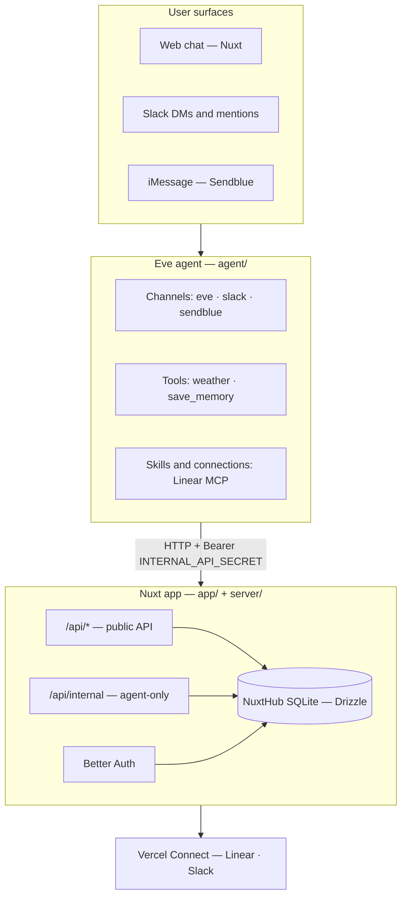

# Personal Agent Template — Architecture

> Back to [README](../README.md) | See also: [Environment](./ENVIRONMENT.md), [Customization](./CUSTOMIZATION.md)

This document describes the technical architecture of Personal Agent Template — a durable personal AI assistant built with Eve, Nuxt 4, and Better Auth.

## System overview

The app runs as two cooperating services on Vercel:



| Vercel service | Entry | Role |
|----------------|-------|------|
| `web` | `/` | Nuxt UI + Nitro API |
| `eve` | `/_eve_internal/eve` | Eve agent runtime |

Configured in [`vercel.json`](../vercel.json).

## Project structure

```
personal-agent-template/
├── agent/                    # Eve agent
│   ├── agent.ts              # Model and agent config
│   ├── channels/             # eve (web), slack, sendblue
│   ├── tools/                # weather, save_memory
│   ├── skills/               # e.g. daily-summary.md
│   ├── connections/          # Linear MCP
│   ├── lib/                  # base-instructions, memory-internal, slack-internal
│   └── instructions.ts       # session.started hooks (memory injection)
├── app/                      # Nuxt frontend
│   ├── pages/                # chat, settings, login
│   ├── components/           # chat UI, profile, integrations
│   └── composables/          # useMemory, useProfile, chat providers
├── server/                   # Nitro API
│   ├── api/                  # Public + internal routes
│   ├── db/                   # Drizzle schema + migrations
│   └── utils/                # memory, profile, auth, connectors
├── shared/                   # Cross-layer types and helpers
│   ├── agent.ts              # Branding metadata
│   └── types/                # memory, profile, thread, connector
└── docs/                     # Documentation
```

## Request flows

### Web chat

1. User opens `/chat/[id]` — Nuxt loads thread via `/api/threads`
2. Chat streams through Eve's Nuxt module (`eve/nuxt`)
3. Tool calls render in [`MessageContentEve.vue`](../app/components/chat/message/MessageContentEve.vue)
4. `save_memory` shows approval UI ([`ToolSaveMemory.vue`](../app/components/chat/tool/ToolSaveMemory.vue))

### Session memory injection

1. Eve fires `session.started` ([`agent/instructions.ts`](../agent/instructions.ts))
2. Agent calls `GET /api/internal/memory?userId=...` with bearer token
3. [`agent/lib/memory-internal.ts`](../agent/lib/memory-internal.ts) builds prompt section
4. Appended to agent instructions for the session

Start a **new chat** after importing memory so injection picks up changes.

### Slack

1. Slack events hit Eve's slack channel ([`agent/channels/slack.ts`](../agent/channels/slack.ts))
2. Linked users map Slack ID → app user via `slack_links` table
3. Unlinked users get instructions to generate a link code in the web app
4. Link flow: web generates code → user DMs `link <code>` → agent consumes via internal API

### Sendblue (iMessage)

1. Sendblue delivers inbound messages to Eve's sendblue channel ([`agent/channels/sendblue.ts`](../agent/channels/sendblue.ts))
2. The sender's E.164 number maps to an app user via `phone_links` (set in **Settings → Profile**)
3. Unlinked senders receive instructions to add their number in the web app
4. Replies go back through Sendblue; tool approvals link to the web chat

### Integrations (Linear)

1. User connects Linear in **Settings → Integrations**
2. Vercel Connect provisions MCP credentials
3. Eve connection ([`agent/connections/linear.ts`](../agent/connections/linear.ts)) exposes Linear tools to the agent

## Internal API

Routes under `/api/internal/*` require:

```
Authorization: Bearer <INTERNAL_API_SECRET>
```

Validated in [`server/utils/internal-api.ts`](../server/utils/internal-api.ts).

| Route | Purpose |
|-------|---------|
| `GET /api/internal/memory` | Fetch user memory for session injection |
| `POST /api/internal/memory` | Save memory from agent tool |
| `GET /api/internal/phone/link` | Resolve phone number → app user |
| `GET /api/internal/slack/link/member` | Resolve Slack user → app user |
| `POST /api/internal/slack/link/consume` | Consume link code |

Agent-side clients live in `agent/lib/*-internal.ts`.

## Database

SQLite via [NuxtHub](https://hub.nuxt.com). Schema in [`server/db/schema/`](../server/db/schema/).

Key tables:

| Table | Purpose |
|-------|---------|
| `user` / `session` / `account` | Better Auth |
| `threads` | Chat threads |
| `user_profile` | Name, timezone, phone |
| `user_memory` | Long-term memory by category |
| `phone_links` | Phone ↔ app user mapping (Sendblue/iMessage) |
| `slack_links` | Slack ↔ app user mapping |
| `slack_link_codes` | Temporary link codes |

Migrations: `pnpm db:generate` → `pnpm db:migrate`.

## Memory model

- **Categories** — fixed set in [`shared/types/memory.ts`](../shared/types/memory.ts)
- **One block per category** — `setMemoryForCategory` replaces all rows for a category
- **Sources** — `import`, `agent`, `manual`
- **Import** — Raycast-style paste parser ([`server/utils/memory-import.ts`](../server/utils/memory-import.ts))

## Auth

[Better Auth](https://www.better-auth.com) with email/password. Config: [`server/utils/auth.ts`](../server/utils/auth.ts), route: [`server/api/auth/[...all].ts`](../server/api/auth/[...all].ts).

Global middleware: [`app/middleware/auth.global.ts`](../app/middleware/auth.global.ts).

## Eve docs

For channels, tools, connections, and deployment details, read Eve guides in `node_modules/eve/dist/docs/public/`.
